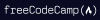

### Hi there, I'm Arnaud Pithon 👋

- 🧑‍💻 Developer passionate about **clean, maintainable code** and **user experience**.  
- 🛠️ Crafting developer utilities for **Neovim** — with a focus on **usability, security, and clarity**.  
- 🌱 Always learning and improving — because code should serve people first.

## Contact

## 📈 Statistiques GitHub

<!--
**ArnaudPithon/ArnaudPithon** is a ✨ _special_ ✨ repository because its `README.md` (this file) appears on your GitHub profile.

Here are some ideas to get you started:

- 🔭 I’m currently working on ...
- 🌱 I’m currently learning ...
- 👯 I’m looking to collaborate on ...
- 🤔 I’m looking for help with ...
- 💬 Ask me about ...
- 📫 How to reach me: ...
- 😄 Pronouns: ...
- ⚡ Fun fact: ...
-->
